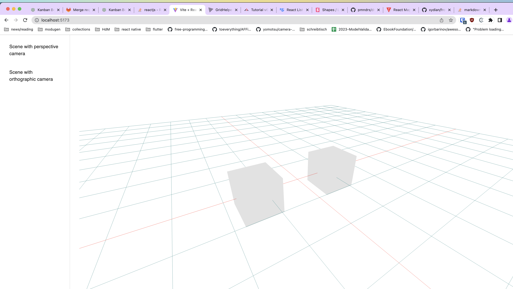
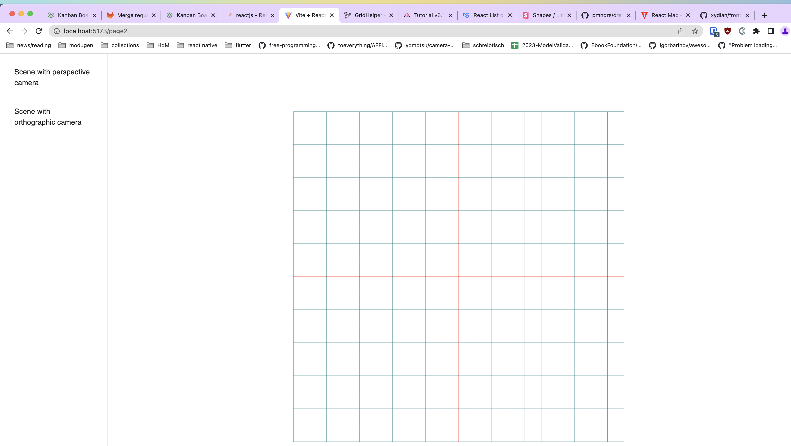

# React frontend intro

## Setup

cd into folder `react`

execute `npm install` to install all required dependencies

run `npm run dev` to start the dev server

access the frontend on `http://localhost:5173/`. It should look like the following. You can use the buttons on the left to switch between the two scenes (orthographic/perspective)



## Tasks

### Task 1

Start the application and go to `Scene with orthographic camera` . This renders a scene with a helper grid and an orthographic camera that looks from top on the displayed grid.



For starters draw a line from -3/0/0 to -3/5/0 on the grid with a thickness of 4 and a color of your choice. Use the [Line component](https://github.com/pmndrs/drei#line) of @react-three/drei. You need to modify `src/pages/page2.tsx` for the changes to appear on the Scene with orthographic camera

### Task 2

Your task is to import the walls in `data/task2.ts` into the page2 component (`src/pages/page2.tsx`) and display them in the scene using the [Line component](https://github.com/pmndrs/drei#line) of @react-three/drei. Use a line thickness of 4

_Hint:_

You are able to render an array within your react component like this

```tsx
const AnyReactComponent = () => {
  const array_items = ["banana", "apple", "strawberry"];

  return (
    <>
      <Heading>My favorite fruits</Heading>

      {array_items.map((fruit, index) => (
        <Text key={index}>{fruit}</Text>
      ))}
    </>
  );
};
```

<details>
  <summary>Solution task 2</summary>
  
  Not yet available
</details>

### Task 3

Take a look at page3 in `src/pages/page3.tsx`. You should add a feature to delete any existing walls. Allow the user to select any wall (use `onClick` property on the Line component). The selected wall index should be stored in a `useState` first. The selected wall should be colore red. If this is working, you should try to store the selected wall index in the zustand store in `src/pages/page3/store.tsx`. You need to add a new property `selectedWall` and a method `setSelectedWall` to the zustand store.

If selecting any wall is working, you should use the `removeWall` method of the zustand store to allow the user to remove any existing wall by pressing the button `Ausgewählte Wand löschen`.

### Task 4

The user should now be able to remove any exsisting walls from the model. Now you should allow him/her to add new walls to the model based on an start and end coordinate (x/y -> z should be 0). Please add two textfields to the existing text fields in page 3 (X End and Y End). Change the onSubmit method of the form in `src/pages/page3.tsx` to add a new wall to the store using the `addWall` method provided by the `usePage3Store` store.

Bonus task: Add a validation that no walls are intersecting. You need to modify the test `isIntersecting` of the validation schema provided to the form in order for this to work. Use [turfjs](https://turfjs.org/) to find intersections of lines.
